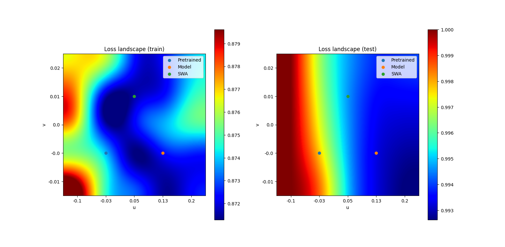

# MVA - Bayesien Machine Learning Project - Averaging Weights Leads to Wider Optima and Better Generalization - Thomas Lemercier, Clement Wang

This repository aims to reproduce the results of the paper "Averaging Weights Leads to Wider Optima and Better Generalization" by Pavel Izmailov, Dmitrii Podoprikhin, Timur Garipov, Dmitry Vetrov and Andrew Gordon Wilson. The paper is available at the following link: https://arxiv.org/abs/1803.05407
The original implementation of the paper mainly tested Stochastic weight averaging (SWA) on image classification. We reimplented the SWA algorithm and extended the experiments to regression tasks and graph classification. You can find our final report [here](BayesianML_Report.pdf).

Loss landscape comparison for MobileNet V2 on CIFAR100|
:-----:|
|


## Installation

The repository has been tested with Python 3.11.4. To install the required packages, run the following command:

```bash
pip install -r requirements.txt
```

You might want to install PyTorch with CUDA support. To do so, follow the instructions on the official website: https://pytorch.org/get-started/locally/

## Usage

All scripts are located in the `src/swa_benchmark/scripts` folder. To run the experiments, you can use the following commands:

```bash
python -m swa_benchmark.scripts.${dataset_name}.${script_name}
```
where `${dataset_name}` is one of `cifar`, `mnist`, `Cluster` and `synthetic`.

For example, to run the experiments on CIFAR-10 with MobileNet V2, you can use the following command:

```bash
python -m swa_benchmark.scripts.cifar.cifar100_mobilenet
```

